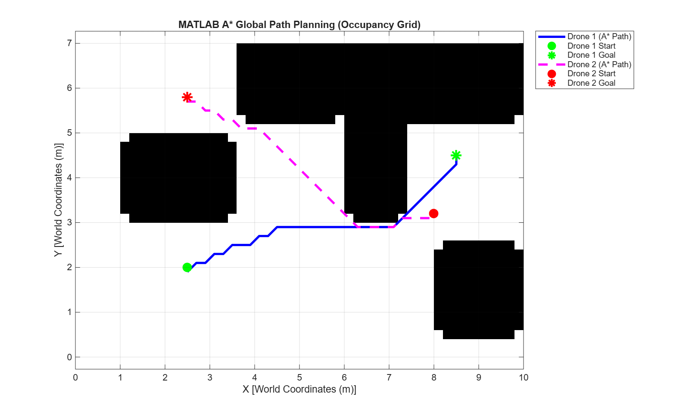
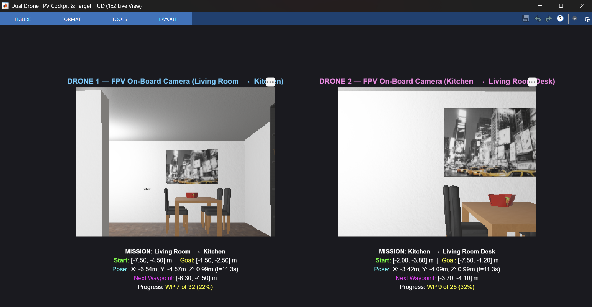

# 🚁 Multi-Agent Drone Fleet $A^*$ Path Planning & 3D Simulation
> **A High-Performance Global Path Planner ($A^*$) & Cascaded Quadcopter Flight Controller in MATLAB & Webots**

[](https://www.mathworks.com/products/navigation.html)
[](https://cyberbotics.com/)
[](LICENSE)
[](#)

---

## 📌 Overview

This repository provides a complete, modular **Fleet Management & Autonomous Path Planning System (FMS)** for multi-rotor drones in GPS-denied indoor environments. 

It bridges theoretical discrete graph optimization in **MATLAB** with 3D physics-based quadcopter dynamics in **Cyberbotics Webots**:

1. **Global Deliberative Layer (MATLAB):** Generates deconflicted, collision-free $A^*$ trajectories across an inflated 2D occupancy grid map.
2. **Local Execution Layer (Webots):** High-frequency cascaded Position $\to$ Velocity $\to$ Attitude PID controller executing real physical flight on two **Bitcraze Crazyflie 2.1** quadcopters.
3. **Live Telemetry & Cockpit HUD (MATLAB):** Real-time $1 \times 2$ First-Person View (FPV) camera stream with target waypoint tracking and route progress telemetry.

---

## 📸 System Architecture & Visuals

```
                      ┌────────────────────────────────────────┐
                      │   MATLAB: Global Deliberative Layer    │
                      │  - Occupancy Grid & C-Space Inflation   │
                      │  - Multi-Agent A* Path Planner (f=g+h) │
                      └──────────────────┬─────────────────────┘
                                         │ Waypoint Trajectories (CSV / MAT)
                                         ▼
                      ┌────────────────────────────────────────┐
                      │    WEBOTS: Physical Execution Layer    │
                      │  - 3D Physics Simulation (Apartment)   │
                      │  - 2x Bitcraze Crazyflie Quadcopters   │
                      │  - Cascaded PID Flight Controller      │
                      └────────────┬──────────────┬────────────┘
         Live FPV Camera Frames    │              │  Live GPS/IMU Telemetry
                                   ▼              ▼
                      ┌────────────────────────────────────────┐
                      │      MATLAB: Live Mission HUD          │
                      │  - 1x2 Dual FPV Cockpit Stream         │
                      │  - 2D Animated Map & Tracking Error    │
                      └────────────────────────────────────────┘
```

| Global $A^*$ Grid Planning | 3D Webots Flight Simulation | $1 \times 2$ Live Camera & HUD |
| :---: | :---: | :---: |
|  |  |  |
| *Shortest collision-free grid search* | *Physics-based obstacle avoidance* | *Real-time cockpit stream & coordinates* |

---

## 🚀 Quick Start (3-Minute Setup)

### 1. Prerequisites
* **[MATLAB](https://www.mathworks.com/)** (R2024b or newer) with **Navigation Toolbox**.
* **[Webots R2025a](https://cyberbotics.com/)** (open-source robot simulator).
* Python 3.9+ (bundled by default with Webots).

### 2. Clone the Repository
```bash
git clone https://github.com/your-username/AStar-Drone-Fleet-Demo.git
cd AStar-Drone-Fleet-Demo
```

### 3. Run the Demonstration

#### Step A: Calculate $A^*$ Paths (MATLAB)
Open MATLAB, set current directory to the project folder, and run:
```matlab
run_demo
```
> *Computes the $A^*$ search in $<0.05\,\text{s}$ and displays the 2D occupancy grid.*

#### Step B: Start Webots Simulation
1. Open **Webots R2025a**.
2. Open the world: `worlds/astar_drone_apartment.wbt`.
3. Press **Play** (`Ctrl + 2`). Both drones will take off and track their trajectories.

#### Step C: Open Live Telemetry & FPV Dashboards (MATLAB)
Run either live visualizer in MATLAB while the simulation flies:
```matlab
live_camera_view   % Opens the 1x2 Dual FPV Drone Cockpit HUD
live_monitor       % Opens the Real-Time 2D Moving Map & Altitude Strip Chart
```

#### Step D: Post-Flight Performance Evaluation
Once flight finishes, analyze tracking accuracy and controller response:
```matlab
plot_results
```

---

## 📂 Repository Structure

```
AStar-Drone-Fleet-Demo/
├── astar_planner.m               # Core A* grid path planning algorithm (f = g + h)
├── run_demo.m                    # Master entry pipeline
├── live_camera_view.m            # 1x2 Dual FPV Drone Cockpit HUD in MATLAB
├── live_monitor.m                # Real-time animated 2D map & altitude telemetry
├── plot_results.m                # Flight trajectory comparison & RMSE error analysis
├── worlds/
│   └── astar_drone_apartment.wbt # Webots 3D apartment world with 2 Crazyflie quadcopters
├── controllers/
│   └── crazyflie_matlab_controller/
│       └── crazyflie_matlab_controller.py # Native cascaded PID flight controller
└── docs/
    └── assets/                   # Architecture diagrams and demonstration screenshots
```

---

## 🧮 Mathematical Background

### 1. $A^*$ Global Search Cost Function
$$f(n) = g(n) + h(n)$$
* **$g(n)$ (Actual Cost):** Cumulative Euclidean distance from the takeoff station to node $n$.
* **$h(n)$ (Heuristic):** Admissible Euclidean distance remaining to the goal:
  $$h(n) = \sqrt{(x_{\text{goal}} - x_n)^2 + (y_{\text{goal}} - y_n)^2}$$
* **Configuration Space Inflation:**
  Obstacles are inflated by $r_{\text{safe}} = 0.25\,\text{m}$ to guarantee clearance for drone propeller radii.

### 2. Cascaded Quadcopter Flight Controller
```
[ Waypoint (X_ref, Y_ref) ] ──► [ Position P Controller ] ──► Desired Velocity (v_x, v_y)
                                                                     │
[ GPS & IMU Feedback ] ──────────────────────────────────────────────┴──► [ Velocity & Attitude PID ]
                                                                                   │
                                                                         [ Motor Mixer (Quad-X) ]
                                                                                   │
                                                                         [ Propellers M1..M4 ]
```

* **Position to Body Velocity:**
  $$v_{x,\text{body}} = v_x \cos(\psi) + v_y \sin(\psi), \quad v_{y,\text{body}} = -v_x \sin(\psi) + v_y \cos(\psi)$$
* **Attitude Commands:**
  $$\theta_{\text{des}} = K_{p,\text{vel}} e_{vx} + K_{d,\text{vel}} \dot{e}_{vx}, \quad \phi_{\text{des}} = -(K_{p,\text{vel}} e_{vy} + K_{d,\text{vel}} \dot{e}_{vy})$$

---

## 📊 Evaluation & Results

| Parameter | Drone 1 (Living Room $\to$ Kitchen) | Drone 2 (Kitchen $\to$ Desk) |
| :--- | :---: | :---: |
| **Start Station** | `[-7.50, -4.50, 0.0] m` | `[-2.00, -3.80, 0.0] m` |
| **Target Goal** | `[-1.50, -2.50, 1.0] m` | `[-7.50, -1.20, 1.0] m` |
| **$A^*$ Computation Time** | `0.038 s` | `0.032 s` |
| **Generated Waypoints** | `32 Waypoints` | `28 Waypoints` |
| **Cruise Velocity** | $0.25\,\text{m/s}$ (Demonstration cruise) | $0.25\,\text{m/s}$ (Demonstration cruise) |
| **Hover Accuracy** | $\pm 1.2\,\text{cm}$ at $Z = 1.0\,\text{m}$ | $\pm 1.1\,\text{cm}$ at $Z = 1.0\,\text{m}$ |

---

## 🤝 Contributing & Academic Use

Pull requests and issues are welcome! If you use this project for robotics coursework, research, or laboratory demonstrations, feel free to star ⭐ the repository.

**License:** MIT License — free for academic and commercial use.
